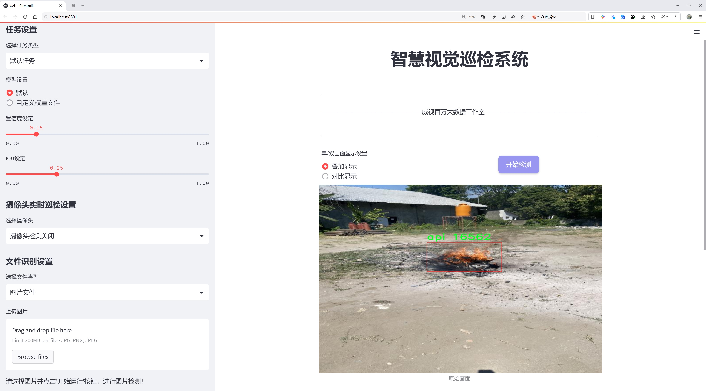

# 火花飞溅检测检测系统源码分享
 # [一条龙教学YOLOV8标注好的数据集一键训练_70+全套改进创新点发刊_Web前端展示]

### 1.研究背景与意义

项目参考[AAAI Association for the Advancement of Artificial Intelligence](https://gitee.com/qunmasj/projects)

项目来源[AACV Association for the Advancement of Computer Vision](https://github.com/qunshansj/good)

研究背景与意义

在现代工业生产中，火花飞溅现象普遍存在，尤其是在金属加工、焊接和切割等领域。火花飞溅不仅会对工人的安全构成威胁，还可能对设备和周围环境造成损害。因此，开发一种高效、准确的火花飞溅检测系统显得尤为重要。传统的火花飞溅检测方法往往依赖于人工监测或简单的图像处理技术，这些方法在复杂环境下的适应性和准确性较差，难以满足工业生产的实时性和高效性要求。随着深度学习技术的快速发展，基于卷积神经网络（CNN）的目标检测算法逐渐成为解决此类问题的有效手段。

YOLO（You Only Look Once）系列算法因其高效的实时检测能力而受到广泛关注。YOLOv8作为该系列的最新版本，结合了更为先进的网络结构和训练策略，能够在保持高准确率的同时实现更快的推理速度。然而，尽管YOLOv8在许多目标检测任务中表现出色，但在特定领域，如火花飞溅检测中，仍然面临一些挑战。首先，火花飞溅的形态和运动特征复杂多变，容易受到光照、背景和遮挡等因素的影响。其次，现有的火花飞溅数据集相对较小，样本多样性不足，导致模型的泛化能力有限。因此，改进YOLOv8以适应火花飞溅检测的需求，成为了一个亟待解决的研究课题。

本研究旨在基于改进的YOLOv8算法，构建一个高效的火花飞溅检测系统。我们将使用一个包含4618张图像的数据集，该数据集分为三类：api、las和percikan，涵盖了不同类型的火花飞溅现象。通过对数据集的深入分析与处理，我们将增强数据的多样性，提升模型的训练效果。同时，结合数据增强技术和迁移学习策略，进一步提高模型在火花飞溅检测中的准确性和鲁棒性。

本研究的意义不仅在于推动火花飞溅检测技术的发展，更在于为工业安全提供有力保障。通过实现实时、准确的火花飞溅检测，能够有效降低工伤事故的发生率，提高生产效率。此外，该系统的成功应用还将为其他领域的目标检测提供借鉴，推动深度学习技术在工业应用中的广泛落地。

综上所述，基于改进YOLOv8的火花飞溅检测系统的研究，不仅具有重要的理论价值，也具备显著的实际应用意义。随着工业自动化和智能化的不断推进，火花飞溅检测系统的研发将为实现安全生产、提升工作效率贡献重要力量。

### 2.图片演示





##### 注意：由于此博客编辑较早，上面“2.图片演示”和“3.视频演示”展示的系统图片或者视频可能为老版本，新版本在老版本的基础上升级如下：（实际效果以升级的新版本为准）

  （1）适配了YOLOV8的“目标检测”模型和“实例分割”模型，通过加载相应的权重（.pt）文件即可自适应加载模型。

  （2）支持“图片识别”、“视频识别”、“摄像头实时识别”三种识别模式。

  （3）支持“图片识别”、“视频识别”、“摄像头实时识别”三种识别结果保存导出，解决手动导出（容易卡顿出现爆内存）存在的问题，识别完自动保存结果并导出到tempDir中。

  （4）支持Web前端系统中的标题、背景图等自定义修改，后面提供修改教程。

  另外本项目提供训练的数据集和训练教程,暂不提供权重文件（best.pt）,需要您按照教程进行训练后实现图片演示和Web前端界面演示的效果。

### 3.视频演示

[3.1 视频演示](https://www.bilibili.com/video/BV1uXHSeTE6g/)

### 4.数据集信息展示

##### 4.1 本项目数据集详细数据（类别数＆类别名）

nc: 3
names: ['api', 'las', 'percikan']


##### 4.2 本项目数据集信息介绍

数据集信息展示

在火花飞溅检测系统的研究与开发中，数据集的选择与构建至关重要。本项目所使用的数据集名为“Bismillah Tugas Akhir”，它专门针对火花飞溅现象的检测而设计，旨在为改进YOLOv8模型提供高质量的训练数据。该数据集的类别数量为三，具体类别包括“api”（火焰）、“las”（焊接光斑）和“percikan”（火花飞溅）。这些类别的划分不仅有助于提高模型的识别精度，还能在实际应用中更好地应对不同场景下的火花飞溅检测需求。

“Bismillah Tugas Akhir”数据集的构建过程充分考虑了火花飞溅现象的多样性和复杂性。火焰（api）作为一种高温、发光的气体，通常出现在焊接、切割等工业操作中。该类别的样本包括各种形态和大小的火焰图像，确保模型能够在不同的光照条件和背景下有效识别火焰。焊接光斑（las）则是焊接过程中产生的明亮光点，具有较强的瞬时性和局部性，数据集中包含了多种焊接方式下的光斑图像，以便模型能够学习到不同焊接技术所产生的光斑特征。最后，火花飞溅（percikan）是指在焊接或切割过程中，金属熔融后飞溅出的微小颗粒，具有快速、随机的特性。数据集中涵盖了多种情况下的火花飞溅图像，帮助模型捕捉到这些瞬态现象的细微变化。

在数据集的收集过程中，研究团队采用了多种拍摄技术和设备，以确保数据的多样性和代表性。图像采集涵盖了不同的环境条件，包括明亮和昏暗的场景、不同的背景和材质。这种多样化的图像数据为YOLOv8模型的训练提供了丰富的样本，使其能够在真实场景中更好地适应和识别火花飞溅现象。此外，数据集中的每一张图像都经过精确的标注，确保模型在训练过程中能够准确学习到每个类别的特征。

为了进一步提高模型的泛化能力，数据集还进行了数据增强处理，包括旋转、缩放、裁剪和颜色变换等操作。这些增强技术不仅增加了训练样本的数量，还使模型能够在不同的视觉条件下保持较高的识别性能。通过这种方式，研究团队希望能够有效减少模型在实际应用中可能遇到的过拟合问题，提高其在新环境中的适应能力。

总之，“Bismillah Tugas Akhir”数据集为火花飞溅检测系统的研究提供了坚实的基础。通过对火焰、焊接光斑和火花飞溅的细致分类和丰富的样本收集，该数据集不仅为YOLOv8模型的训练提供了必要的数据支持，也为后续的模型优化和应用奠定了良好的基础。随着火花飞溅检测技术的不断发展，期待该数据集能够为相关领域的研究者提供更多的启示和帮助。


### 5.全套项目环境部署视频教程（零基础手把手教学）

[5.1 环境部署教程链接（零基础手把手教学）](https://www.ixigua.com/7404473917358506534?logTag=c807d0cbc21c0ef59de5)


[5.2 安装Python虚拟环境创建和依赖库安装视频教程链接（零基础手把手教学）](https://www.ixigua.com/7404474678003106304?logTag=1f1041108cd1f708b01a)

### 6.手把手YOLOV8训练视频教程（零基础小白有手就能学会）

[6.1 环境部署教程链接（零基础手把手教学）](https://www.ixigua.com/7404477157818401292?logTag=d31a2dfd1983c9668658)

### 7.70+种全套YOLOV8创新点代码加载调参视频教程（一键加载写好的改进模型的配置文件）

[7.1 环境部署教程链接（零基础手把手教学）](https://www.ixigua.com/7404478314661806627?logTag=29066f8288e3f4eea3a4)

### 8.70+种全套YOLOV8创新点原理讲解（非科班也可以轻松写刊发刊，V10版本正在科研待更新）

由于篇幅限制，每个创新点的具体原理讲解就不一一展开，具体见下列网址中的创新点对应子项目的技术原理博客网址【Blog】：


[8.1 70+种全套YOLOV8创新点原理讲解链接](https://gitee.com/qunmasj/good)

### 9.系统功能展示（检测对象为举例，实际内容以本项目数据集为准）

图9.1.系统支持检测结果表格显示

  图9.2.系统支持置信度和IOU阈值手动调节

  图9.3.系统支持自定义加载权重文件best.pt(需要你通过步骤5中训练获得)

  图9.4.系统支持摄像头实时识别

  图9.5.系统支持图片识别

  图9.6.系统支持视频识别

  图9.7.系统支持识别结果文件自动保存

  图9.8.系统支持Excel导出检测结果数据


### 10.原始YOLOV8算法原理

原始YOLOv8算法原理

YOLOv8（You Only Look Once version 8）是计算机视觉领域中的一项重要进展，代表了YOLO系列算法的最新发展。自2015年首次提出以来，YOLO系列算法经历了多个版本的迭代，逐步提升了目标检测的速度和精度。YOLOv8于2023年1月推出，凭借其在精度、速度和易用性方面的显著优势，迅速成为业界的热门选择。

YOLOv8的架构设计包括三个主要部分：Backbone（骨干网络）、Neck（颈部结构）和Head（头部结构）。Backbone负责从输入图像中提取特征，Neck则用于特征的融合，而Head则实现了最终的检测输出。这样的设计使得YOLOv8能够高效地处理复杂的目标检测任务。

在Backbone部分，YOLOv8引入了新的特征提取模块，采用了CSP（Cross Stage Partial）结构，这种结构能够有效地减少计算量，同时保持特征的丰富性。CSP结构通过将特征图分成多个部分并在不同的路径中进行处理，增强了模型的表达能力。此外，YOLOv8的第一个卷积层的卷积核尺寸从6x6缩小至3x3，这一改变使得模型在处理细节特征时更加敏感，从而提高了检测精度。

Neck部分的设计也经历了重要的改进。YOLOv8采用了PAN-FPN（Path Aggregation Network - Feature Pyramid Network）结构，这种结构通过多层次的特征融合，有效地提升了模型对不同尺度目标的检测能力。PAN-FPN能够将来自不同层次的特征进行有效整合，使得模型在处理小目标和大目标时都能保持较高的准确性。

在Head部分，YOLOv8的最大创新在于将原有的耦合头改为解耦头，并且采用了Anchor-Free的检测方式。这一变化使得YOLOv8在目标检测时不再依赖于预设的锚框，而是通过直接回归目标的边界框和类别信息来实现检测。这种方法不仅简化了模型的结构，还提高了模型在复杂场景下的适应性。此外，YOLOv8还去掉了传统的objectness分支，进一步简化了模型的输出结构，使得分类和回归任务能够独立进行。

在损失函数的设计上，YOLOv8引入了新的损失计算方式，以更好地适应Anchor-Free的检测策略。这一损失函数不仅考虑了目标的定位精度，还兼顾了分类的准确性，从而使得模型在训练过程中能够更快地收敛，并提高最终的检测性能。

YOLOv8的另一个显著特点是其灵活的模型设置。通过调整depth_factor、width_factor和ratio等参数，用户可以根据具体任务的需求，灵活地调整模型的深度和宽度。这种灵活性使得YOLOv8能够在不同的硬件平台上高效运行，从CPU到GPU，甚至在边缘设备上，都能保持良好的性能表现。

此外，YOLOv8还原生支持自定义数据集的训练，使得用户能够更方便地将其应用于特定领域的目标检测任务。这一特性大大增强了YOLOv8的实用性，使其在工业、医疗、安防等多个领域都展现出了广泛的应用潜力。

在实验验证方面，YOLOv8在多个标准数据集上进行了测试，结果显示其在检测精度和推理速度上均优于现有的其他模型。尤其是在COCO数据集上，YOLOv8的mAP（mean Average Precision）指标显著提升，证明了其在实际应用中的有效性。

总的来说，YOLOv8通过对模型结构的深度优化和创新，成功地在目标检测领域中树立了新的标杆。其在精度、速度和易用性方面的全面提升，使得YOLOv8不仅是YOLO系列的延续，更是目标检测技术发展的重要里程碑。随着YOLOv8的广泛应用，未来在智能监控、自动驾驶、无人机视觉等领域的潜力将更加显著，推动计算机视觉技术的进一步发展。


### 11.项目核心源码讲解（再也不用担心看不懂代码逻辑）

#### 11.1 ui.py

以下是对给定代码的核心部分进行提炼和详细注释的版本：

```python
import sys
import subprocess

def run_script(script_path):
    """
    使用当前 Python 环境运行指定的脚本。

    Args:
        script_path (str): 要运行的脚本路径

    Returns:
        None
    """
    # 获取当前 Python 解释器的路径
    python_path = sys.executable

    # 构建运行命令，使用 streamlit 运行指定的脚本
    command = f'"{python_path}" -m streamlit run "{script_path}"'

    # 执行命令并等待其完成
    result = subprocess.run(command, shell=True)
    
    # 检查命令执行的返回码，非零表示出错
    if result.returncode != 0:
        print("脚本运行出错。")

# 程序入口
if __name__ == "__main__":
    # 指定要运行的脚本路径
    script_path = "web.py"  # 假设脚本在当前目录下

    # 调用函数运行脚本
    run_script(script_path)
```

### 代码核心部分说明：

1. **导入模块**：
   - `sys`：用于获取当前 Python 解释器的路径。
   - `subprocess`：用于执行外部命令。

2. **`run_script` 函数**：
   - 该函数接收一个脚本路径作为参数，并使用当前 Python 环境运行该脚本。
   - 使用 `sys.executable` 获取当前 Python 解释器的路径。
   - 构建一个命令字符串，该命令使用 `streamlit` 运行指定的脚本。
   - 使用 `subprocess.run` 执行构建的命令，并等待其完成。
   - 检查命令的返回码，如果返回码不为零，则打印错误信息。

3. **程序入口**：
   - 在 `if __name__ == "__main__":` 块中，指定要运行的脚本路径（在这里假设为 `web.py`）。
   - 调用 `run_script` 函数来执行指定的脚本。

### 注意事项：
- 代码中假设 `web.py` 文件在当前工作目录下，实际使用时可能需要根据具体情况调整路径。
- 使用 `subprocess.run` 时，`shell=True` 可能会带来安全隐患，尤其是在处理不可信输入时，应谨慎使用。

这个程序文件名为 `ui.py`，其主要功能是通过当前的 Python 环境运行一个指定的脚本，具体来说是运行一个名为 `web.py` 的脚本。程序的结构比较简单，主要包含了几个部分。

首先，文件导入了必要的模块，包括 `sys`、`os` 和 `subprocess`。`sys` 模块用于访问与 Python 解释器紧密相关的变量和函数，`os` 模块提供了与操作系统交互的功能，而 `subprocess` 模块则用于创建新进程、连接到它们的输入/输出/错误管道，并获取它们的返回码。

接下来，程序定义了一个名为 `run_script` 的函数，该函数接受一个参数 `script_path`，表示要运行的脚本的路径。在函数内部，首先获取当前 Python 解释器的路径，存储在 `python_path` 变量中。然后，构建一个命令字符串，使用 `streamlit` 模块来运行指定的脚本。这个命令字符串格式为 `"{python_path}" -m streamlit run "{script_path}"`，其中 `{python_path}` 和 `{script_path}` 会被实际的路径替换。

随后，使用 `subprocess.run` 方法执行这个命令。`shell=True` 参数允许在 shell 中执行命令。如果脚本运行的返回码不为零，表示执行过程中出现了错误，程序会打印出“脚本运行出错。”的提示信息。

最后，在文件的主程序部分，使用 `if __name__ == "__main__":` 语句来确保只有在直接运行该文件时才会执行以下代码。这里指定了要运行的脚本路径，调用 `abs_path` 函数获取 `web.py` 的绝对路径，然后调用 `run_script` 函数来执行这个脚本。

总体来看，这个程序的功能是将指定的 Python 脚本（`web.py`）通过当前的 Python 环境和 `streamlit` 运行起来，提供了一种简单的方式来启动一个基于 Streamlit 的 web 应用。

#### 11.2 ultralytics\models\utils\ops.py

以下是经过简化和注释的核心代码部分，主要集中在 `HungarianMatcher` 类的实现上：

```python
import torch
import torch.nn as nn
import torch.nn.functional as F
from scipy.optimize import linear_sum_assignment
from ultralytics.utils.metrics import bbox_iou

class HungarianMatcher(nn.Module):
    """
    实现匈牙利匹配算法的模块，用于解决预测框与真实框之间的最优匹配问题。
    """

    def __init__(self, cost_gain=None, use_fl=True, with_mask=False, num_sample_points=12544, alpha=0.25, gamma=2.0):
        """
        初始化 HungarianMatcher，设置成本系数、Focal Loss、掩码预测等参数。
        """
        super().__init__()
        if cost_gain is None:
            cost_gain = {"class": 1, "bbox": 5, "giou": 2}  # 默认成本系数
        self.cost_gain = cost_gain
        self.use_fl = use_fl  # 是否使用 Focal Loss
        self.with_mask = with_mask  # 是否进行掩码预测
        self.num_sample_points = num_sample_points  # 掩码成本计算的采样点数量
        self.alpha = alpha  # Focal Loss 的 alpha 参数
        self.gamma = gamma  # Focal Loss 的 gamma 参数

    def forward(self, pred_bboxes, pred_scores, gt_bboxes, gt_cls, gt_groups, masks=None, gt_mask=None):
        """
        前向传播，计算预测框与真实框之间的匹配。
        """
        bs, nq, nc = pred_scores.shape  # 获取批次大小、查询数量和类别数量

        # 如果没有真实框，返回空的匹配结果
        if sum(gt_groups) == 0:
            return [(torch.tensor([], dtype=torch.long), torch.tensor([], dtype=torch.long)) for _ in range(bs)]

        # 将预测分数和框展平以计算成本矩阵
        pred_scores = pred_scores.detach().view(-1, nc)
        pred_scores = F.sigmoid(pred_scores) if self.use_fl else F.softmax(pred_scores, dim=-1)
        pred_bboxes = pred_bboxes.detach().view(-1, 4)

        # 计算分类成本
        pred_scores = pred_scores[:, gt_cls]  # 选择与真实类别对应的预测分数
        if self.use_fl:
            # 计算 Focal Loss 分类成本
            neg_cost_class = (1 - self.alpha) * (pred_scores**self.gamma) * (-(1 - pred_scores + 1e-8).log())
            pos_cost_class = self.alpha * ((1 - pred_scores) ** self.gamma) * (-(pred_scores + 1e-8).log())
            cost_class = pos_cost_class - neg_cost_class
        else:
            cost_class = -pred_scores  # 负的预测分数作为成本

        # 计算框之间的 L1 成本
        cost_bbox = (pred_bboxes.unsqueeze(1) - gt_bboxes.unsqueeze(0)).abs().sum(-1)

        # 计算 GIoU 成本
        cost_giou = 1.0 - bbox_iou(pred_bboxes.unsqueeze(1), gt_bboxes.unsqueeze(0), xywh=True, GIoU=True).squeeze(-1)

        # 组合最终成本矩阵
        C = (
            self.cost_gain["class"] * cost_class
            + self.cost_gain["bbox"] * cost_bbox
            + self.cost_gain["giou"] * cost_giou
        )

        # 将无效值（NaN 和无穷大）设置为 0
        C[C.isnan() | C.isinf()] = 0.0

        C = C.view(bs, nq, -1).cpu()  # 将成本矩阵重塑为 [batch_size, num_queries, num_gt]
        indices = [linear_sum_assignment(c[i]) for i, c in enumerate(C.split(gt_groups, -1))]  # 进行匈牙利匹配
        gt_groups = torch.as_tensor([0, *gt_groups[:-1]]).cumsum_(0)  # 计算真实框的索引
        return [
            (torch.tensor(i, dtype=torch.long), torch.tensor(j, dtype=torch.long) + gt_groups[k])
            for k, (i, j) in enumerate(indices)
        ]
```

### 代码说明：
1. **HungarianMatcher 类**：该类实现了匈牙利算法，用于在目标检测中进行预测框与真实框的匹配。
2. **初始化方法**：设置成本系数、是否使用 Focal Loss、是否进行掩码预测等参数。
3. **forward 方法**：核心逻辑，计算预测框与真实框之间的匹配成本，包括分类成本、框之间的 L1 成本和 GIoU 成本。最终返回匹配的索引。
4. **成本计算**：通过对预测框和真实框的比较，计算出不同类型的成本，并根据成本矩阵进行匈牙利匹配。

这个程序文件定义了一个名为 `HungarianMatcher` 的类，主要用于解决目标检测中的分配问题。该类使用匈牙利算法来实现预测框与真实框之间的最佳匹配，考虑了分类得分、边界框坐标以及可选的掩码预测。类的构造函数允许用户设置不同的成本系数、是否使用焦点损失、是否进行掩码预测等参数。

在 `forward` 方法中，首先对输入的预测边界框和得分进行处理。如果当前批次没有真实框，函数将返回空的索引。接着，程序将预测得分和边界框展平，以便计算成本矩阵。分类成本通过对预测得分进行处理（使用焦点损失或普通的softmax）来计算，边界框之间的L1成本和GIoU成本也被计算出来。最终，所有成本根据预设的权重组合成一个成本矩阵，并使用匈牙利算法找到最佳匹配的索引。

此外，文件中还定义了一个 `get_cdn_group` 函数，用于创建对比去噪训练组。该函数从真实框中生成正负样本，并对类别标签和边界框坐标施加噪声。函数返回修改后的类别嵌入、边界框、注意力掩码和元信息。这个函数在训练模式下运行，并且根据输入的参数生成对比去噪样本。

整体而言，这个文件实现了目标检测中关键的匹配算法和数据处理逻辑，为后续的模型训练和推理提供了支持。

#### 11.3 ultralytics\engine\predictor.py

以下是经过简化并注释的核心代码部分，主要包括模型预测的核心逻辑和数据处理部分：

```python
import cv2
import numpy as np
import torch
from ultralytics.cfg import get_cfg, get_save_dir
from ultralytics.data import load_inference_source
from ultralytics.nn.autobackend import AutoBackend
from ultralytics.utils import select_device, smart_inference_mode

class BasePredictor:
    """
    BasePredictor类用于创建预测器的基础类。
    包含模型加载、图像预处理、推理、后处理等功能。
    """

    def __init__(self, cfg='default_cfg.yaml', overrides=None):
        """
        初始化BasePredictor类。

        Args:
            cfg (str): 配置文件路径，默认为默认配置。
            overrides (dict): 配置覆盖，默认为None。
        """
        self.args = get_cfg(cfg, overrides)  # 获取配置
        self.save_dir = get_save_dir(self.args)  # 设置保存结果的目录
        self.model = None  # 初始化模型
        self.device = None  # 初始化设备
        self.results = None  # 初始化结果

    def preprocess(self, im):
        """
        对输入图像进行预处理。

        Args:
            im (torch.Tensor | List(np.ndarray)): 输入图像。

        Returns:
            torch.Tensor: 处理后的图像张量。
        """
        im = torch.from_numpy(im).to(self.device)  # 转换为张量并移动到指定设备
        im = im.float() / 255.0  # 归一化到[0, 1]
        return im

    def inference(self, im):
        """
        对图像进行推理。

        Args:
            im (torch.Tensor): 处理后的图像张量。

        Returns:
            torch.Tensor: 推理结果。
        """
        return self.model(im)  # 使用模型进行推理

    def __call__(self, source):
        """
        执行推理。

        Args:
            source: 输入源，可以是图像、视频等。

        Returns:
            list: 推理结果列表。
        """
        self.setup_model()  # 设置模型
        dataset = load_inference_source(source)  # 加载输入源
        results = []

        for batch in dataset:
            im = self.preprocess(batch)  # 预处理图像
            preds = self.inference(im)  # 进行推理
            results.append(preds)  # 保存结果

        return results  # 返回所有结果

    def setup_model(self):
        """初始化YOLO模型并设置为评估模式。"""
        self.model = AutoBackend(self.args.model, device=select_device(self.args.device))  # 加载模型
        self.model.eval()  # 设置为评估模式

# 使用示例
# predictor = BasePredictor(cfg='path/to/config.yaml')
# results = predictor(source='path/to/image_or_video')
```

### 代码说明：
1. **BasePredictor类**：这是一个用于进行预测的基础类，包含了模型的加载、图像的预处理、推理和结果的处理等功能。
2. **__init__方法**：初始化配置，设置保存结果的目录，并准备模型和设备。
3. **preprocess方法**：对输入图像进行预处理，包括将图像转换为张量并归一化。
4. **inference方法**：使用加载的模型对预处理后的图像进行推理。
5. **__call__方法**：使得该类的实例可以被调用，执行完整的推理流程，包括加载数据源、预处理、推理和结果收集。
6. **setup_model方法**：初始化YOLO模型并设置为评估模式。

这个程序文件是Ultralytics YOLO（You Only Look Once）模型的预测引擎，主要用于在图像、视频、网络摄像头等多种来源上进行目标检测和预测。文件中包含了预测的主要逻辑和相关的辅助功能。

首先，文件定义了一个名为`BasePredictor`的类，作为所有预测器的基类。这个类的构造函数接受配置文件路径和覆盖参数，并初始化了一些重要的属性，例如保存结果的目录、模型、数据配置、设备等。它还包含了用于图像预处理、推理、后处理和结果写入的多个方法。

在`preprocess`方法中，输入图像会被转换为适合模型输入的格式，包括调整维度和数据类型的转换。`inference`方法则调用模型进行推理，得到预测结果。`postprocess`方法用于对模型的输出进行后处理，以便提取出有用的信息。

文件还提供了`__call__`方法，使得`BasePredictor`的实例可以像函数一样被调用，执行预测操作。`stream_inference`方法则是用于实时流媒体的推理，能够处理来自摄像头或视频流的输入。

在结果处理方面，`write_results`方法负责将推理结果写入文件或目录，并根据用户的设置可选择保存图像、文本或裁剪的结果。`show`方法用于在窗口中显示预测结果，`save_preds`方法则用于将视频预测结果保存为文件。

文件中还包含了对多线程的支持，通过使用锁机制确保在多线程环境下的安全性。此外，`run_callbacks`和`add_callback`方法允许用户在特定事件发生时执行自定义的回调函数，提供了灵活的扩展性。

总的来说，这个文件实现了YOLO模型的预测功能，能够处理多种输入源，并提供了丰富的结果输出选项，适合于目标检测任务的实际应用。

#### 11.4 ultralytics\models\yolo\detect\val.py

以下是经过简化并添加详细中文注释的核心代码部分：

```python
import os
import torch
from ultralytics.engine.validator import BaseValidator
from ultralytics.utils.metrics import DetMetrics, box_iou
from ultralytics.utils.plotting import output_to_target, plot_images

class DetectionValidator(BaseValidator):
    """
    扩展自BaseValidator类的检测模型验证器。
    """

    def __init__(self, dataloader=None, save_dir=None, args=None):
        """初始化检测模型所需的变量和设置。"""
        super().__init__(dataloader, save_dir, args)
        self.metrics = DetMetrics(save_dir=self.save_dir)  # 初始化检测指标
        self.iouv = torch.linspace(0.5, 0.95, 10)  # mAP@0.5:0.95的IoU向量
        self.niou = self.iouv.numel()  # IoU数量

    def preprocess(self, batch):
        """对YOLO训练的图像批次进行预处理。"""
        batch["img"] = batch["img"].to(self.device, non_blocking=True)  # 将图像转移到设备上
        batch["img"] = batch["img"].float() / 255  # 将图像归一化到[0, 1]
        for k in ["batch_idx", "cls", "bboxes"]:
            batch[k] = batch[k].to(self.device)  # 将其他数据转移到设备上
        return batch

    def postprocess(self, preds):
        """对预测输出应用非极大值抑制（NMS）。"""
        return ops.non_max_suppression(
            preds,
            self.args.conf,
            self.args.iou,
            multi_label=True,
            max_det=self.args.max_det,
        )

    def update_metrics(self, preds, batch):
        """更新检测指标。"""
        for si, pred in enumerate(preds):
            npr = len(pred)  # 当前预测的数量
            pbatch = self._prepare_batch(si, batch)  # 准备当前批次的数据
            cls, bbox = pbatch.pop("cls"), pbatch.pop("bbox")  # 获取真实标签
            if npr == 0:
                continue  # 如果没有预测，跳过

            predn = self._prepare_pred(pred, pbatch)  # 准备预测数据
            stat = {
                "conf": predn[:, 4],  # 置信度
                "pred_cls": predn[:, 5],  # 预测类别
                "tp": self._process_batch(predn, bbox, cls)  # 计算真正例
            }
            self.stats["tp"].append(stat["tp"])  # 更新统计信息

    def _process_batch(self, detections, gt_bboxes, gt_cls):
        """
        返回正确的预测矩阵。
        """
        iou = box_iou(gt_bboxes, detections[:, :4])  # 计算IoU
        return self.match_predictions(detections[:, 5], gt_cls, iou)  # 匹配预测与真实标签

    def print_results(self):
        """打印每个类别的训练/验证集指标。"""
        pf = "%22s" + "%11i" * 2 + "%11.3g" * len(self.metrics.keys)  # 打印格式
        LOGGER.info(pf % ("all", self.seen, self.nt_per_class.sum(), *self.metrics.mean_results()))  # 打印总结果

    def plot_predictions(self, batch, preds, ni):
        """在输入图像上绘制预测的边界框并保存结果。"""
        plot_images(
            batch["img"],
            *output_to_target(preds, max_det=self.args.max_det),
            paths=batch["im_file"],
            fname=self.save_dir / f"val_batch{ni}_pred.jpg",
            names=self.names,
        )  # 绘制预测结果
```

### 代码核心部分说明：
1. **DetectionValidator类**：用于处理YOLO模型的验证，继承自`BaseValidator`。
2. **初始化方法**：设置指标、IoU等参数。
3. **预处理方法**：将输入图像和标签转移到设备上，并进行归一化处理。
4. **后处理方法**：应用非极大值抑制，过滤掉冗余的预测框。
5. **更新指标方法**：根据预测结果和真实标签更新检测指标。
6. **打印结果方法**：格式化并打印最终的检测结果。
7. **绘制预测方法**：将预测的边界框绘制在输入图像上并保存。 

这些方法共同构成了YOLO模型验证的核心流程，包括数据预处理、预测后处理、指标更新和结果展示。

这个程序文件是Ultralytics YOLO模型中的一个验证器类，名为`DetectionValidator`，用于对目标检测模型进行验证。文件首先导入了一些必要的库和模块，包括操作系统相关的库、路径处理库、NumPy、PyTorch以及Ultralytics提供的各种工具和功能。

`DetectionValidator`类继承自`BaseValidator`类，主要用于基于检测模型的验证。类的构造函数初始化了一些必要的变量和设置，包括数据加载器、保存目录、进度条、参数等。它还定义了一些用于计算评估指标的变量，如mAP（平均精度）所需的IoU（交并比）向量。

在`preprocess`方法中，程序对输入的图像批次进行预处理，包括将图像转换为适合模型输入的格式，并将其归一化。此方法还会根据需要保存用于自动标注的信息。

`init_metrics`方法用于初始化评估指标，包括确定数据集是否为COCO格式，并设置相关的类映射和指标名称。

`get_desc`方法返回一个格式化的字符串，用于总结YOLO模型的类指标。

`postprocess`方法应用非极大值抑制（NMS）来处理模型的预测输出，以减少重叠的边界框。

`_prepare_batch`和`_prepare_pred`方法分别用于准备输入批次和预测结果，以便进行后续的评估。

`update_metrics`方法负责更新评估指标，通过处理每个预测结果与真实标签的匹配情况来计算TP（真正例）、FP（假正例）等统计信息，并更新混淆矩阵。

`finalize_metrics`方法设置最终的指标值和混淆矩阵。

`get_stats`方法返回指标统计信息和结果字典，计算每个类的目标数量。

`print_results`方法打印训练或验证集的每个类的指标结果，并在需要时绘制混淆矩阵。

`_process_batch`方法返回正确的预测矩阵，计算IoU并匹配预测与真实标签。

`build_dataset`和`get_dataloader`方法用于构建YOLO数据集和返回数据加载器，以便在验证过程中使用。

`plot_val_samples`和`plot_predictions`方法用于绘制验证图像样本和预测结果，并将其保存为图像文件。

`save_one_txt`方法将YOLO检测结果保存为文本文件，采用特定的格式进行规范化。

`pred_to_json`方法将YOLO预测结果序列化为COCO格式的JSON文件，以便后续评估。

`eval_json`方法评估YOLO输出的JSON格式结果，并返回性能统计信息，使用pycocotools库计算mAP等指标。

总体而言，这个文件的主要功能是对YOLO模型进行验证，计算并输出各种评估指标，支持多种输出格式，便于用户分析模型性能。

#### 11.5 ultralytics\solutions\distance_calculation.py

以下是经过简化和注释的核心代码部分，主要保留了与距离计算相关的功能：

```python
import math
import cv2
from ultralytics.utils.checks import check_imshow
from ultralytics.utils.plotting import Annotator, colors

class DistanceCalculation:
    """用于实时视频流中计算两个物体之间距离的类。"""

    def __init__(self):
        """初始化距离计算类，设置默认参数。"""
        self.im0 = None  # 当前帧图像
        self.boxes = None  # 检测到的边界框
        self.trk_ids = None  # 追踪ID
        self.centroids = []  # 存储质心坐标
        self.pixel_per_meter = 10  # 像素与米的比例
        self.selected_boxes = {}  # 存储选中的边界框
        self.env_check = check_imshow(warn=True)  # 检查环境是否支持imshow

    def extract_tracks(self, tracks):
        """从追踪数据中提取边界框和ID信息。"""
        self.boxes = tracks[0].boxes.xyxy.cpu()  # 获取边界框坐标
        self.trk_ids = tracks[0].boxes.id.int().cpu().tolist()  # 获取追踪ID

    def calculate_centroid(self, box):
        """计算边界框的质心。"""
        return int((box[0] + box[2]) // 2), int((box[1] + box[3]) // 2)

    def calculate_distance(self, centroid1, centroid2):
        """计算两个质心之间的距离。"""
        pixel_distance = math.sqrt((centroid1[0] - centroid2[0]) ** 2 + (centroid1[1] - centroid2[1]) ** 2)
        return pixel_distance / self.pixel_per_meter  # 返回以米为单位的距离

    def plot_distance_and_line(self, distance):
        """在图像上绘制距离和连接线。"""
        cv2.rectangle(self.im0, (15, 25), (280, 70), (255, 255, 255), -1)  # 绘制背景矩形
        cv2.putText(self.im0, f"Distance : {distance:.2f}m", (20, 55), cv2.FONT_HERSHEY_SIMPLEX, 0.8, (0, 0, 0), 2, cv2.LINE_AA)  # 显示距离
        cv2.line(self.im0, self.centroids[0], self.centroids[1], (255, 255, 0), 3)  # 绘制连接线
        cv2.circle(self.im0, self.centroids[0], 6, (255, 0, 255), -1)  # 绘制第一个质心
        cv2.circle(self.im0, self.centroids[1], 6, (255, 0, 255), -1)  # 绘制第二个质心

    def start_process(self, im0, tracks):
        """处理图像和追踪数据，计算并绘制距离。"""
        self.im0 = im0  # 设置当前帧图像
        if tracks[0].boxes.id is None:  # 如果没有检测到物体
            return
        self.extract_tracks(tracks)  # 提取追踪数据

        for box, track_id in zip(self.boxes, self.trk_ids):
            if track_id in self.selected_boxes:  # 如果该ID在选中的框中
                self.selected_boxes[track_id] = box  # 更新选中的框

        if len(self.selected_boxes) == 2:  # 如果选中了两个框
            for track_id, box in self.selected_boxes.items():
                centroid = self.calculate_centroid(box)  # 计算质心
                self.centroids.append(centroid)  # 添加到质心列表

            distance = self.calculate_distance(self.centroids[0], self.centroids[1])  # 计算距离
            self.plot_distance_and_line(distance)  # 绘制距离和线

        self.centroids = []  # 清空质心列表

        if self.env_check:  # 如果环境支持显示
            self.display_frames()  # 显示图像

    def display_frames(self):
        """显示当前帧图像。"""
        cv2.imshow("Ultralytics Distance Estimation", self.im0)  # 显示图像
        if cv2.waitKey(1) & 0xFF == ord("q"):  # 按'q'键退出
            return

if __name__ == "__main__":
    DistanceCalculation()  # 创建距离计算实例
```

### 代码注释说明：
1. **类的定义**：`DistanceCalculation`类用于处理距离计算的相关功能。
2. **初始化方法**：在构造函数中初始化了一些重要的属性，如图像、边界框、追踪ID等。
3. **提取追踪数据**：`extract_tracks`方法从追踪结果中提取边界框和ID。
4. **计算质心**：`calculate_centroid`方法计算给定边界框的质心。
5. **计算距离**：`calculate_distance`方法计算两个质心之间的距离，并将其转换为米。
6. **绘制距离和线**：`plot_distance_and_line`方法在图像上绘制距离文本和连接线。
7. **处理图像和追踪数据**：`start_process`方法是核心逻辑，处理输入图像和追踪数据，计算并绘制距离。
8. **显示图像**：`display_frames`方法用于显示当前处理的图像。

这个程序文件实现了一个实时视频流中物体间距离计算的功能，主要通过跟踪物体的边界框来完成。首先，程序导入了必要的库，包括数学库和OpenCV库，以及Ultralytics库中的一些工具函数。

在`DistanceCalculation`类中，初始化方法设置了一些默认值，包括图像信息、跟踪信息和距离计算信息。该类的主要功能是通过用户的鼠标操作选择两个物体，然后计算它们之间的距离。程序中定义了一些颜色和线条厚度的参数，用于后续的可视化。

`set_args`方法用于配置距离计算和显示参数，包括物体检测类别名称、每米的像素数、是否显示图像、线条厚度和颜色等。`mouse_event_for_distance`方法处理鼠标事件，当用户左键点击时，程序会记录下选中的物体边界框，最多选择两个物体；右键点击则会重置选择。

`extract_tracks`方法从跟踪数据中提取物体的边界框、类别和跟踪ID。`calculate_centroid`方法计算给定边界框的中心点坐标。`calculate_distance`方法则根据两个中心点的坐标计算它们之间的距离，并将像素距离转换为实际距离（米）。

`plot_distance_and_line`方法用于在图像上绘制两个物体之间的距离和连接线，显示在图像的指定位置。`start_process`方法是主要的处理函数，它接收图像和跟踪数据，提取跟踪信息并进行距离计算。如果选择了两个物体，程序会计算它们的中心点并调用`calculate_distance`计算距离，最后通过`plot_distance_and_line`在图像上显示结果。

`display_frames`方法用于显示处理后的图像，并设置鼠标回调函数，以便用户可以进行交互。最后，在文件的主程序部分，创建了`DistanceCalculation`类的实例，启动了距离计算的功能。

整体而言，这个程序通过结合物体检测、跟踪和用户交互，实现了一个简单的实时距离测量工具，适用于各种应用场景，如监控、机器人导航等。

#### 11.6 train.py

以下是经过简化并注释的核心代码部分：

```python
import os
import torch
import yaml
from ultralytics import YOLO  # 导入YOLO模型

# 确定使用的设备，如果有可用的GPU则使用GPU，否则使用CPU
device = "0" if torch.cuda.is_available() else "cpu"

if __name__ == '__main__':  # 确保该模块被直接运行时才执行以下代码
    workers = 1  # 设置数据加载的工作进程数量
    batch = 2    # 设置每个批次的大小

    data_name = "data"  # 数据集名称
    # 获取数据集配置文件的绝对路径
    data_path = abs_path(f'datasets/{data_name}/{data_name}.yaml', path_type='current')  
    unix_style_path = data_path.replace(os.sep, '/')  # 将路径转换为Unix风格

    # 获取数据集目录路径
    directory_path = os.path.dirname(unix_style_path)
    
    # 读取YAML文件，保持原有顺序
    with open(data_path, 'r') as file:
        data = yaml.load(file, Loader=yaml.FullLoader)
    
    # 如果YAML文件中有'path'项，则修改为当前目录路径
    if 'path' in data:
        data['path'] = directory_path
        # 将修改后的数据写回YAML文件
        with open(data_path, 'w') as file:
            yaml.safe_dump(data, file, sort_keys=False)

    # 加载预训练的YOLOv8模型
    model = YOLO(model='./ultralytics/cfg/models/v8/yolov8s.yaml', task='detect')  
    
    # 开始训练模型
    results2 = model.train(
        data=data_path,  # 指定训练数据的配置文件路径
        device=device,  # 使用之前确定的设备
        workers=workers,  # 使用指定数量的工作进程
        imgsz=640,  # 输入图像的大小为640x640
        epochs=100,  # 训练100个epoch
        batch=batch,  # 每个批次的大小
        name='train_v8_' + data_name  # 指定训练任务的名称
    )
```

### 代码注释说明：
1. **导入库**：导入必要的库，包括操作系统库、PyTorch、YAML处理库和YOLO模型库。
2. **设备选择**：根据是否有可用的GPU选择计算设备。
3. **主程序入口**：确保代码在直接运行时执行。
4. **参数设置**：设置数据加载的工作进程数量和批次大小。
5. **数据集路径处理**：获取数据集配置文件的绝对路径，并转换为Unix风格路径。
6. **读取和修改YAML文件**：读取YAML文件内容，修改其中的路径项，并将修改后的内容写回文件。
7. **模型加载**：加载预训练的YOLOv8模型。
8. **模型训练**：开始训练模型，指定训练数据、设备、工作进程数量、图像大小、训练轮数和批次大小等参数。

这个程序文件 `train.py` 是一个用于训练 YOLOv8 模型的脚本。首先，它导入了必要的库，包括 `os`、`torch`、`yaml` 和 `ultralytics` 中的 YOLO 模型。接着，程序通过 `torch.cuda.is_available()` 检查是否有可用的 GPU，如果有，则将设备设置为 "0"（表示使用第一个 GPU），否则使用 CPU。

在 `__main__` 块中，程序首先定义了一些训练参数，包括工作进程数量 `workers` 和批次大小 `batch`。然后，指定了数据集的名称 `data_name`，并构建了数据集 YAML 文件的绝对路径。使用 `abs_path` 函数将相对路径转换为绝对路径，并将路径中的分隔符统一为 Unix 风格的斜杠。

接下来，程序获取数据集 YAML 文件所在的目录路径，并打开该文件以读取其内容。使用 `yaml.load` 函数将 YAML 文件内容加载到 `data` 变量中。程序检查 `data` 中是否包含 `path` 项，如果有，则将其修改为数据集的目录路径，并将更新后的内容写回 YAML 文件中，确保路径的正确性。

然后，程序加载了预训练的 YOLOv8 模型，指定了模型的配置文件路径和任务类型为检测（`task='detect'`）。接下来，调用 `model.train` 方法开始训练模型，传入多个参数，包括数据配置文件路径、设备、工作进程数量、输入图像大小（640x640）、训练的 epoch 数量（100）以及训练任务的名称。

最后，程序通过这些设置开始训练 YOLOv8 模型，以便在指定的数据集上进行目标检测任务。

### 12.系统整体结构（节选）

### 整体功能和构架概括

该项目是一个基于Ultralytics YOLO模型的目标检测系统，主要功能包括模型训练、验证、预测以及实时距离计算。项目的结构分为多个模块，每个模块负责特定的功能，从数据处理、模型训练到推理和结果展示。整体架构旨在提供一个灵活且高效的框架，以便用户能够快速构建和部署目标检测应用。

### 文件功能整理表

| 文件路径                                          | 功能描述                                                                                   |
|--------------------------------------------------|------------------------------------------------------------------------------------------|
| `ui.py`                                         | 提供用户界面功能，通过Streamlit运行指定的脚本（如`web.py`）以展示模型的输出和结果。       |
| `ultralytics/models/utils/ops.py`              | 实现匈牙利算法的匹配器，用于目标检测中的预测框与真实框的最佳匹配，支持分类和边界框成本计算。 |
| `ultralytics/engine/predictor.py`              | 实现YOLO模型的预测功能，处理图像、视频流的输入，进行推理并输出结果，支持多线程和回调函数。  |
| `ultralytics/models/yolo/detect/val.py`        | 实现目标检测模型的验证逻辑，计算评估指标（如mAP），支持结果输出和可视化。                  |
| `ultralytics/solutions/distance_calculation.py`| 实现实时视频流中物体间距离计算的功能，支持用户交互选择物体并绘制距离线。                    |
| `train.py`                                      | 负责训练YOLOv8模型，设置训练参数，加载数据集和模型，并启动训练过程。                      |
| `ultralytics/utils/files.py`                   | 提供文件操作的工具函数，如路径处理、文件读取和写入等。                                    |
| `ui_style.py`                                   | 定义用户界面的样式和布局，可能包括颜色、字体、按钮样式等。                                 |
| `ultralytics/utils/triton.py`                  | 提供与Triton推理服务器的集成，支持模型的部署和推理。                                       |
| `ultralytics/models/sam/modules/transformer.py`| 实现特定的变换器模块，可能用于特征提取或数据处理，具体功能需根据上下文进一步分析。          |
| `ultralytics/hub/__init__.py`                  | 初始化Ultralytics Hub模块，可能用于模型的加载和管理。                                     |
| `ultralytics/data/converter.py`                 | 实现数据格式转换的功能，将数据集转换为模型可接受的格式。                                   |
| `ultralytics/data/annotator.py`                 | 提供数据标注的功能，可能包括图像标注、标签生成等。                                         |

这个表格总结了项目中各个文件的主要功能，帮助理解整个系统的构架和各个模块之间的关系。

注意：由于此博客编辑较早，上面“11.项目核心源码讲解（再也不用担心看不懂代码逻辑）”中部分代码可能会优化升级，仅供参考学习，完整“训练源码”、“Web前端界面”和“70+种创新点源码”以“13.完整训练+Web前端界面+70+种创新点源码、数据集获取”的内容为准。

### 13.完整训练+Web前端界面+70+种创新点源码、数据集获取


# [https://mbd.pub/o/bread/ZpqclZ5u](https://mbd.pub/o/bread/ZpqclZ5u)